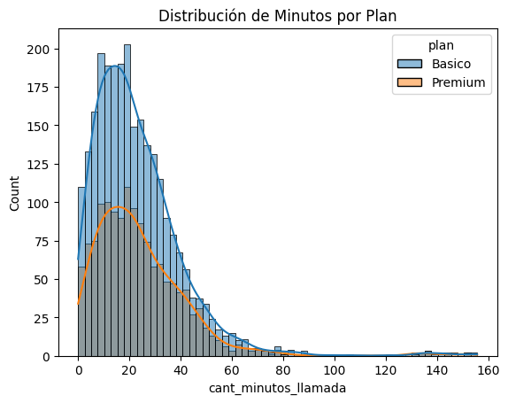

# ConnectaTel: análisis de consumo y segmentación de clientes

**Mario Alberto Vivero Sahagún | Python · pandas · NumPy · Matplotlib · Seaborn**

Análisis del uso de llamadas y mensajes de 4,000 clientes de una empresa de telecomunicaciones en Latinoamérica, y revisión de la calidad de los datos para segmentarlos.

## Pregunta de negocio

¿Cómo se distribuye el uso de llamadas y mensajes y qué tan confiables son los datos para segmentar clientes?

## Hallazgo clave

- **El plan Básico concentra a la mayoría de los clientes:** 64.9% frente a 35.1% del plan Premium.
- **El uso por cliente es bajo:** la mediana es de 5 mensajes y 4 llamadas, con máximos de 17 y 15. La duración acumulada tiene una cola larga hacia valores altos (media de 23.32 contra mediana de 19.78).
- **La segmentación original no se ajustaba a los datos:** sus límites de 50 y 200 quedaban muy por encima de los máximos observados, así que todos los clientes caían en la categoría "Bajo". El código revisado usa límites de 5 y 10.
- **El 14.1% de los clientes no tiene una ciudad válida** (565 de 4,000 entre nulos y valores `?`).

**Qué recomiendo:** verificar los registros extremos y la consistencia de las fechas antes de clasificar a un cliente como intensivo o proponer cambios de plan.

## Alcance y evidencia disponible

El notebook original registra **4,000 clientes, 40,000 eventos y 2 planes**. Los resultados de este README provienen de las salidas del notebook original. Los CSV originales no están incluidos en el repositorio.

| Fuente requerida | Contenido |
|---|---|
| `plans.csv` | Tarifas y franquicias de Básico y Premium |
| `users_latam.csv` | Clientes, edad, ciudad, registro, plan y baja |
| `usage.csv` | Eventos de llamadas y mensajes |

El corte analítico del ejercicio es 2024. Los nulos en fecha de baja se conservan; no deben borrarse por su alta frecuencia sin entender su significado.

## Resultados históricos

Las siguientes cifras proceden de salidas del notebook original. Los perfiles tienen métricas no nulas para 3,999 de los 4,000 clientes.

| Métrica por usuario | Media | Mediana | Máximo | Límite superior IQR |
|---|---:|---:|---:|---:|
| Mensajes registrados | 5.52 | 5 | 17 | 11.50 |
| Llamadas registradas | 4.48 | 4 | 15 | 10.50 |
| Duración acumulada original | 23.32 | 19.78 | 155.69 | 61.8575 |

**La duración original sumaba `duration` en todos los tipos de evento.** No debe interpretarse como un total de minutos de llamadas ya validado. El código revisado restringe esa suma a llamadas y debe volver a ejecutarse con los CSV.

El plan Básico representa **64.875%** de clientes y Premium **35.125%**. La media de duración supera la mediana y la visualización muestra una cola derecha; eso describe la distribución histórica, pero no confirma que todos los extremos sean consumos reales legítimos.

*Gráfico extraído del notebook original. Son frecuencias absolutas y hay más clientes Básico; no se usa para demostrar diferencias proporcionales entre planes.*

## Problemas detectados en el análisis original y ajustes propuestos

- **Segmentación:** el original usaba límites de 50 y 200 pese a que el máximo era 15 llamadas y 17 mensajes. Con esos resultados, los 3,999 perfiles completos quedan en Bajo; el perfil sin métricas termina incorrectamente en Alto. La revisión usa las reglas descriptivas del ejercicio (5 y 10), con categoría explícita para ausencia de actividad observada.
- **Fechas:** la salida muestra 40 registros en 2026, aunque la narrativa decía que no había años posteriores a 2024. El original sí los marcó posteriormente como nulos; la revisión conserva una bandera y contabiliza la incidencia.
- **Ciudad:** quedaron 96 valores `?` después de imputar 469 nulos como Unknown. La revisión trata ambos como información ausente: 565 casos en la evidencia histórica, equivalentes al 14.125% de clientes.
- **Agregación:** se filtra el periodo y se suman duraciones solo en llamadas. Los eventos sin fecha se cuentan como excluidos; los nulos estructurales no se convierten indiscriminadamente a cero.
- **Joins:** se añaden controles de claves, referencias y cardinalidad al unir perfiles y catálogo. Su resultado está pendiente de las fuentes.
- **Interpretación:** se retiran afirmaciones de que los outliers son usuarios intensivos confirmados o de que ya existen oportunidades concretas de upselling.

## Recomendaciones de negocio

1. Verificar registros extremos y consistencia de fechas antes de clasificar clientes como intensivos.
2. Recalcular la segmentación y comparar proporciones dentro de cada plan, evitando confundir tamaño de grupo con mayor uso.
3. Contrastar uso **mensual** y meses de exposición con las franquicias del plan. No comparar directamente totales del periodo contra límites mensuales.
4. Incorporar consumo de datos móviles, reglas de facturación y costos antes de calcular ahorro o recomendar un plan más caro. `usage` no incluye consumo de GB.

No se midieron incrementos de ingresos, retención ni resultados de campañas. Los segmentos propuestos son hipótesis para investigar, no impacto comercial demostrado.

## Archivos

| Archivo | Estado |
|---|---|
| [Análisis revisado](notebooks/analisis_connectatel_revisado.ipynb) | Código corregido; requiere los tres CSV; sin salidas de ejecución real |
| [Evidencia histórica](notebooks/evidencia_historica.ipynb) | Tablas y resultados conservados del original; lectura sin ejecutar código |
| [Notas metodológicas](docs/notas_metodologicas.md) | Reglas, límites y cambios |
| [Resumen ejecutivo](docs/resumen_ejecutivo.md) | Lectura de negocio revisada |
| `images/` | Visualizaciones históricas extraídas del notebook |

## Reproducción

Para consultar la evidencia, abre el README o el notebook histórico en GitHub. Para ejecutar el análisis revisado, coloca los tres CSV en `data/`, instala `python -m pip install -r requirements.txt` y abre el notebook con `jupyter notebook`. No se descargan datos automáticamente ni se generan datos sustitutos.

Se comprobó la sintaxis y la lógica de segmentación con casos controlados, pero no el flujo completo sin los archivos fuente. Los originales recibidos no fueron modificados. No se verificó la licencia de las fuentes ni se les asigna una licencia abierta.

## Limitaciones

- Proyecto académico presentado como caso de análisis; no corresponde a un encargo para una empresa de telecomunicaciones real.
- Las cifras son resultados históricos del notebook original. El notebook con los ajustes propuestos no se ha ejecutado con los datos fuente, porque los CSV no se incluyen.
- La duración original sumaba todos los tipos de evento, por lo que no equivale a minutos de llamadas validados.
- No se midieron incrementos de ingresos, retención ni resultados de campañas; los segmentos propuestos son hipótesis.
